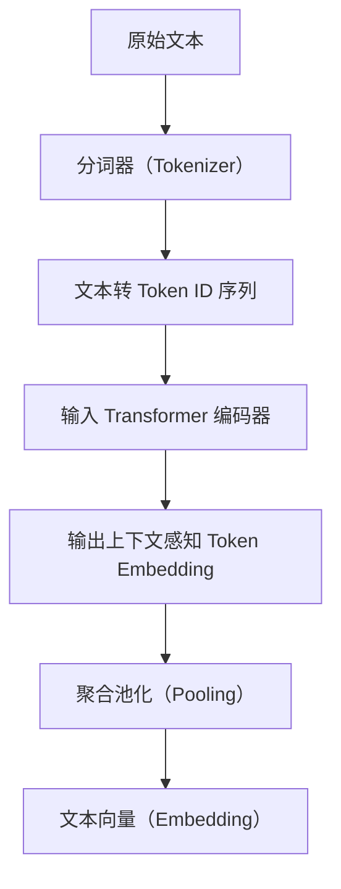

## 一、什么是文本嵌入？

**文本嵌入（Text Embedding）** 是将自然语言中的词语、句子或文档，**映射到一个连续的、低维的向量空间**中，使得语义相近的文本在向量空间中距离较近。

通俗地说，文本嵌入就是把文字变成“可以计算的数字向量”，是各种 NLP 任务（如文本分类、检索、问答、推荐系统等）的基础。

------

## 二、文本嵌入算法的类型概览

| 类型              | 方法                                                | 特点                                           |
| ----------------- | --------------------------------------------------- | ---------------------------------------------- |
| **词嵌入**        | Word2Vec、GloVe、FastText                           | 每个词一个向量，无法处理句子/文档层语义        |
| **句子/文档嵌入** | InferSent、USE、Sentence-BERT、Transformers Pooling | 支持语句/段落级语义，能更好表达上下文          |
| **上下文嵌入**    | ELMo、BERT、RoBERTa、GPT、Longformer 等             | 每个词的表示会根据上下文动态变化（语义更准确） |

------

## 三、文本嵌入算法完整流程（以 BERT 为例）



------

### 步骤 1：文本预处理

#### ✅ 原始文本

例如：`"今天天气很好，我想去公园散步。"`

#### ✅ 分词（Tokenization）

- 分成模型支持的最小单元（token）：

```text
["今", "天天", "气", "很", "好", "，", "我", "想", "去", "公", "园", "散", "步", "。"]
```

#### ✅ 转换为 Token ID

使用预训练模型的词表（vocab）将 Token 转换为数字（即 ID），形成输入向量：

```text
[101, 2454, 1921, 4638, ..., 102]  # 101 和 102 为 CLS 和 SEP 标记
```

------

### 步骤 2：Transformer 编码（BERT为例）

将 Token ID 输入预训练语言模型（如 BERT），得到每个 Token 的上下文语义表示：

- 输出形状为：`[batch_size, sequence_length, hidden_size]`
- 每个词的向量是经过自注意力机制（Self-Attention）处理后的结果

例如，每个 token 被嵌入为一个 768 维向量（BERT-base）。

------

### 步骤 3：嵌入向量的聚合（Pooling）

将所有 Token 向量聚合为一个文本整体的向量，常见方式有：

| 方法              | 说明                                                  |
| ----------------- | ----------------------------------------------------- |
| CLS Token         | 取第一个 `[CLS]` Token 的向量作为整句表示（BERT默认） |
| Mean Pooling      | 对所有 Token 向量做平均                               |
| Max Pooling       | 对每个维度取最大值                                    |
| Attention Pooling | 用注意力机制权重聚合 Token                            |

> ✅ 推荐：**Mean Pooling**（如 Sentence-BERT）通常比 CLS 表现更稳定。

------

### 步骤 4：输出文本嵌入

最终生成的文本嵌入是一个固定长度的向量，例如：

```python
[0.182, -0.091, 0.210, ..., 0.013]  # 长度为 768 或 1024
```

这个向量即可用于相似度计算、分类、检索等各种下游任务。

------

## 四、常见嵌入模型对比

| 模型                       | 支持级别  | 特点                      | 适用场景             |
| -------------------------- | --------- | ------------------------- | -------------------- |
| Word2Vec                   | 词        | 无上下文信息，静态        | 简单分类、词相似度   |
| GloVe                      | 词        | 基于全局共现矩阵          | 语义词库构建         |
| FastText                   | 词        | 支持子词建模              | 小语种、未登录词处理 |
| BERT                       | 词/句/段  | 上下文动态嵌入            | 精准语义表示         |
| Sentence-BERT              | 句子      | 适合句子相似度            | 问答匹配、检索       |
| Jina Embeddings            | 段/文档   | 长文本支持、Late Chunking | 长文检索、多段问答   |
| Universal Sentence Encoder | 句子/段落 | 可部署性强，轻量          | 文本聚类、检索       |

------

## 五、常见应用场景

| 应用场景        | 用法                                      |
| --------------- | ----------------------------------------- |
| 文本分类        | 将文本嵌入向量送入分类器（如 SVM、MLP）   |
| 文本检索        | 用向量表示在数据库中做最近邻搜索（FAISS） |
| 文本相似度      | 余弦相似度计算两个向量之间的语义相近度    |
| 问答系统（RAG） | 嵌入问题与知识文档，检索再生成回答        |
| 推荐系统        | 用用户兴趣嵌入与内容向量匹配              |

------

## 六、Python 示例（Sentence-BERT）

```python
from sentence_transformers import SentenceTransformer
model = SentenceTransformer('paraphrase-MiniLM-L6-v2')

# 输入句子列表
sentences = ["今天是个好天气", "我想去公园散步"]

# 获取文本嵌入（每个句子 -> 一个向量）
embeddings = model.encode(sentences)

# 计算相似度
from sklearn.metrics.pairwise import cosine_similarity
similarity = cosine_similarity([embeddings[0]], [embeddings[1]])
print("语义相似度：", similarity[0][0])
```

------

## 七、小结

| 阶段     | 内容                                 |
| -------- | ------------------------------------ |
| 文本准备 | 清洗、分词、编码为 Token ID          |
| 编码阶段 | 输入 Transformer 模型获取 Token 嵌入 |
| 向量聚合 | Pooling 操作生成句子/段落嵌入向量    |
| 向量输出 | 得到语义丰富的低维向量，用于下游任务 |

------

