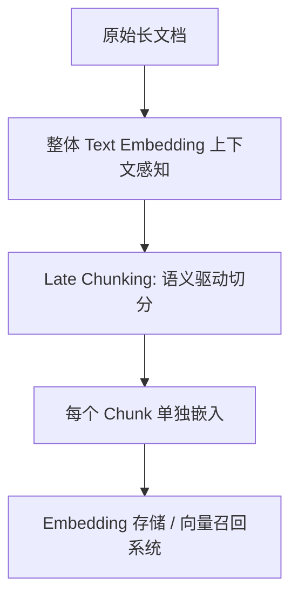
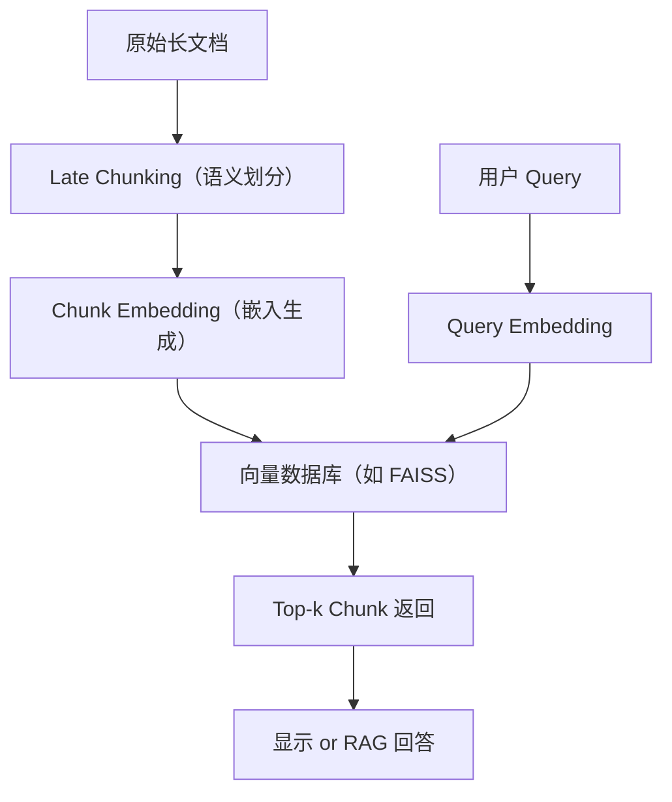

下面将从原理、流程到示例，分步详解 **Late Chunking** 与 **Text Embedding** 在自然语言处理（NLP）中的完整应用过程。

------

## 一、背景与动机

在许多下游任务（如语义检索、文档相似度、问答系统）中，往往需要对较长文本进行高效且语义保留良好的向量化表示。传统做法是先将长文本切分为若干“块”（chunk），再分别对每块进行编码（早期切分，early chunking），但这种方式容易丢失跨块的上下文信息，导致检索或对比效果下降。
 **Late Chunking** 则是在编码后再切分，将全局上下文融入每个块的表示中，从而兼顾了长文本的全局语义和局部精细度 citeturn0search0turn0search6。

------

## 二、什么是 Late Chunking

- **定义**：Late Chunking 指先使用支持长上下文的预训练 Transformer 模型，对整个长文本（可数千 Token）一次性进行前向计算，得到每个 Token 的上下文感知嵌入；然后再根据预设的块大小和步长，将这些 Token 嵌入“切分”为若干块；最后对每块内的 Token 嵌入进行聚合（如平均池化）以获得块级向量表示。
- **核心优势**：
  1. **全局上下文**：每个 Token 嵌入都已考虑整个文档的信息；
  2. **无额外训练**：只需在切分与池化阶段做调整，无需额外微调；
  3. **兼容性强**：可适配各种长上下文模型（如 Longformer、Jina Embeddings-v2 等）。 citeturn0search2turn0search3。

------

## 三、Late Chunking 的流程详解


1. **分词（Tokenization）**
   - 使用与模型匹配的分词器（如 WordPiece、SentencePiece）将文本切分为 Token 序列。
2. **长上下文编码**
   - 将所有 Token 送入支持长序列输入的 Transformer 模型（如 Longformer、Jina Embeddings-v2）。
   - 输出每个 Token 的高维向量（通常 768 或 1024 维）。
3. **后期切分（Late Chunking）**
   - 设定块大小（`chunk_size`，如 256 Token）和步长（`stride`，如 128 Token）。
   - 在 Token 嵌入序列上滑动窗口，切出若干重叠或非重叠的块。
4. **聚合池化**
   - 对每块内的 Token 向量做平均池化（Mean Pooling）或最大池化（Max Pooling），得到该块的向量表示。
5. **存储与检索**
   - 将所有块向量存入向量数据库（如 FAISS、Weaviate），用于后续的相似度检索或下游任务。 citeturn0search4

------

## 四、Text Embedding（文本嵌入）概述

1. **嵌入层次**
   - **词级（Word Embedding）**：Word2Vec、GloVe；
   - **句子/段落级（Sentence/Paragraph Embedding）**：Sentence-BERT、Universal Sentence Encoder；
   - **文档级（Document Embedding）**：基于 Transformer 的 CLS Token 表示或池化输出。
2. **常用策略**
   - **CLS Token**：取 Transformer 输出的第一个特殊标记向量；
   - **Mean Pooling**：对所有 Token 嵌入求平均；
   - **Max Pooling**：对所有维度取最大值。
3. **预训练 vs 微调**
   - **预训练模型**：直接使用公开模型；
   - **微调**：在下游检索或分类任务上做对比学习（Contrastive Learning）等，以提升特定领域性能。

------

## 五、Late Chunking 与 Text Embedding 的结合

- **传统早期切分（Early Chunking）**
  - 优点：内存和计算开销小；
  - 缺点：每块独立编码，缺少跨块信息，语义易碎。
- **Late Chunking**
  - 通过全局编码 + 后切分，既保留了全局语义，也获得了局部细粒度表示，尤其适合**长文档检索**和**分段问答**场景。
- **典型应用**
  1. **检索增强生成（RAG）**：先检索相关块，再拼接至生成模型；
  2. **文档相似度**：块级对比，找到最相似的文本片段；
  3. **摘要与分类**：对每块做下游分类/聚类，最后汇总。

------

## 六、示例代码（Python + Transformers）

```python
from transformers import AutoTokenizer, AutoModel
import torch
import numpy as np

# 1. 准备模型与分词器
model_name = "longformer-base-4096"
tokenizer = AutoTokenizer.from_pretrained(model_name)
model = AutoModel.from_pretrained(model_name)

# 2. 分词并编码（一次性处理全文）
text = "这里是一段很长的文本……"
inputs = tokenizer(text, return_tensors="pt", truncation=False)
with torch.no_grad():
    outputs = model(**inputs)  # last_hidden_state: (1, L, D)

token_embeddings = outputs.last_hidden_state.squeeze(0)  # (L, D)

# 3. Late Chunking 参数
chunk_size = 256
stride = 128
embeddings = []
L, D = token_embeddings.shape

# 4. 切分与池化
for start in range(0, L, stride):
    end = min(start + chunk_size, L)
    chunk = token_embeddings[start:end]  # (<=chunk_size, D)
    pooled = chunk.mean(dim=0)           # Mean Pooling
    embeddings.append(pooled.numpy())

# embeddings 即为各块的向量列表
embeddings = np.stack(embeddings, axis=0)  # (num_chunks, D)
```

------

## 七、Late Chunking 与 Text Embedding 的结合机

### ✅ 整体流程如下：



### 📍 步骤详解：

#### Step 1：整体语义理解

使用上下文感知模型（如 BERT、Longformer、Jina Embeddings、Claude Embeddings 等）对整个文档获取整体语义表示：

- 有助于构建分块的全局上下文参考。

#### Step 2：Late Chunking

使用以下方式切分为若干 chunk：

- 语义相似性检测（如句向量余弦相似度下降）
- 主题转移检测（如 LDA 分布变化）
- 对齐 Markdown 或 HTML 层级结构（如标题层级）

例如可以定义一个规则：

```python
当句子相邻向量余弦相似度低于 0.75 时，断开为新 chunk
```

#### Step 3：每个 Chunk 嵌入

对每个 chunk 使用模型嵌入（通常共享一个预训练模型）：

```text
Chunk 1 → vector1
Chunk 2 → vector2
...
Chunk N → vectorN
```

#### Step 4：用于向量召回或语义搜索

将所有 Chunk 嵌入存入向量数据库（如 FAISS、Milvus、Weaviate），实现向量级语义搜索或问答系统的精确召回。                                                                                                                

------

## 八、如何评估嵌入质量：用**召回效果**体现

### 📍 什么是召回？

在语义搜索中，召回（Recall）是指模型能否从数据库中找到与用户 query 语义最接近的目标内容。

### 📊 评估指标包括：

| 指标                            | 含义                                     |
| ------------------------------- | ---------------------------------------- |
| **Recall@k**                    | 在 top-k 结果中是否包含正确答案          |
| **MRR（Mean Reciprocal Rank）** | 正确答案排在第几位，取倒数平均           |
| **nDCG**                        | 正确结果的排序相关性（考虑位置影响）     |
| **Embedding 相似度分布**        | 相似句对和不相似句对之间的余弦相似度差距 |

### ✅ 评估流程示意：

```text
给定 query: "如何提高英语口语水平？"
目标文档: 包含多个语义块（chunk）

→ 执行向量检索（基于 query 的嵌入）
→ 召回 top-k 文档块
→ 判断是否命中相关内容块（hit）
→ 记录 hit 排名（rank）
```

可以用人工构造的 QA 或搜索任务，构建测试集，比如：

```json
{
  "query": "汉字是谁发明的",
  "relevant_chunk": "甲骨文的发现表明，汉字最早起源于商代……"
}
```

------

## 九、实际场景中如何部署这套机制？

### ✅ 使用 Jina AI 或 LangChain + FAISS 的完整系统架构：



### ✅ 嵌入模型推荐：

| 类型       | 模型                                     | 特点               |
| ---------- | ---------------------------------------- | ------------------ |
| 通用嵌入   | `sentence-transformers/all-MiniLM-L6-v2` | 快速、小巧         |
| 中文语义   | `shibing624/text2vec-base-chinese`       | 中文优化           |
| 多语言长文 | `jinaai/jina-embedding-b-en`             | 支持 late chunking |
| 高性能     | `BAAI/bge-large-zh` / `m3e`              | 高召回表现         |


## 九、**Late Chunking** 的一个进阶方式 —— **基于句子语义相似度动态断句分块**

### **Late Chunking 进阶：基于句子语义相似度的动态断句分块**

在自然语言处理（NLP）任务中，**Late Chunking（延迟分块）** 是一种动态调整文本分块的方法，相比传统的固定长度分块（如按字符数或单词数切分），它能够更好地保留语义连贯性。而 **基于句子语义相似度的动态断句分块** 则进一步优化了分块的合理性，确保每个块内的句子在语义上高度相关，同时在不同块之间保持较低的语义相似度。

------

## **1. 传统分块方法的局限性**

- **固定长度分块（Fixed-size Chunking）**
  - 例如按 512 个 token 切分文本。
  - **问题**：可能切断句子，破坏语义连贯性。
- **按句子分割（Sentence Splitting）**
  - 使用标点符号（如句号、问号）切分。
  - **问题**：短句子可能导致信息稀疏，长句子可能超出模型限制（如 BERT 的 512-token 限制）。

------

## **2. 基于语义相似度的动态断句分块**

### **核心思想**

- **计算句子间的语义相似度**（如使用 `sentence-transformers` 计算嵌入向量 + 余弦相似度）。
- **动态合并相似句子**，直到达到最大长度限制或语义变化较大时切分。

### **适用场景**

- **长文本处理**（如文档摘要、问答系统、RAG 应用）。
- **需要保持语义连贯性的任务**（如对话分析、篇章理解）。


## 十、总结一句话

> **Late Chunking + Text Embedding 是构建高质量、结构化、可召回的语义系统的关键技术路径，召回指标则是最直观评估其嵌入质量的方式。**
